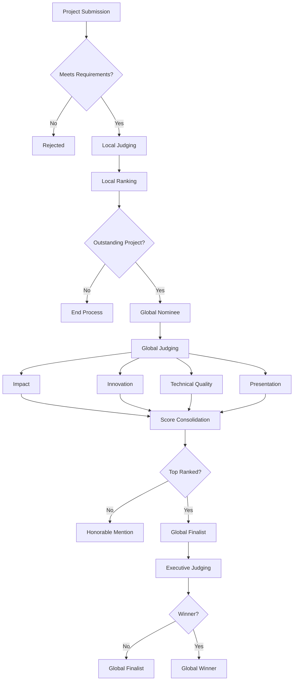

# NASA Space Apps Challenge 2026

## Project Review and Global Nominee Selection Process

```mermaid
flowchart TD

A[Project Submission] --> B{Meets Requirements?}

B -->|No| C[Rejected]
B -->|Yes| D[Local Judging]

D --> E[Local Ranking]

E --> F{Outstanding Project?}

F -->|No| G[End Process]
F -->|Yes| H[Global Nominee]

H --> I[Global Judging]

I --> J[Impact]
I --> K[Innovation]
I --> L[Technical Quality]
I --> M[Presentation]

J --> N[Score Consolidation]
K --> N
L --> N
M --> N

N --> O{Top Ranked?}

O -->|No| P[Honorable Mention]
O -->|Yes| Q[Global Finalist]

Q --> R[Executive Judging]

R --> S{Winner?}

S -->|No| T[Global Finalist]
S -->|Yes| U[Global Winner]
```
